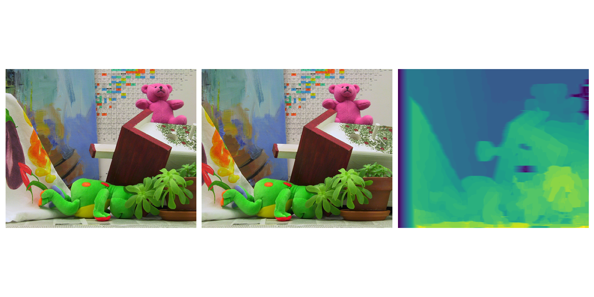

# Stereo Matching Experiment

I found PyTorch an excellent tool to prototype CUDA-based kernels for experimenting with computer vision algorithms.
I revamp my old stereo matching code with CUDA in this repository and rewrite them using modern CUDA and PyTorch.

Here's a video from the old implementation:

[](http://www.youtube.com/watch?v=EuIyLVVpwGs "Stereo matching")

and a sample estimation:



**Methods**

* Cost measurements:
  * Sum of squared distances (SSD)
  * Birchfield
* Aggregation mechanisms:
  * Semiglobal matching
* Disparity reducer
  * Winner takes all
  * Dynamic Programming

**Note for AI practitioners**: The operations aren't differentiable.

## Roadmap

* Version 0.1.*: Just porting/rewriting of the old code.
* Version 1.0.*: Fix/improve unit testing and continuous integration.
* Version 1.*.*: Optimizations of the CUDA code.
* Version 2.0.0: Experiments with features extracted from neural networks.

## Getting Started

**Requirements**:

* Common C++ build tools
* CUDA Toolkit>=10.0
* Pytorch>=1.0

**Installing**:

```shell
$ pip install git+https://github.com/otaviog/stereo-matching
```

## Benchmarking

```
---------------------------------------------------------------------------- benchmark 'aggregation': 2 tests ----------------------------------------------------------------------------
Name (time in ms)          Min                 Max                Mean            StdDev              Median               IQR            Outliers       OPS            Rounds  Iterations
------------------------------------------------------------------------------------------------------------------------------------------------------------------------------------------
test_bm_sgm_gpu         6.8900 (1.0)        7.5300 (1.0)        6.9917 (1.0)      0.0848 (1.0)        6.9755 (1.0)      0.0391 (1.0)           5;6  143.0258 (1.0)          94           1
test_bm_sgm_cpu       451.0489 (65.46)    465.8883 (61.87)    458.6411 (65.60)    5.7751 (68.10)    457.5974 (65.60)    8.5925 (219.51)        2;0    2.1804 (0.02)          5           1
------------------------------------------------------------------------------------------------------------------------------------------------------------------------------------------

------------------------------------------------------------------------------------------------ benchmark 'cost': 5 tests ------------------------------------------------------------------------------------------------
Name (time in us)                       Min                     Max                    Mean                StdDev                  Median                   IQR            Outliers       OPS            Rounds  Iterations
---------------------------------------------------------------------------------------------------------------------------------------------------------------------------------------------------------------------------
test_bm_birchfield_gpu               7.2490 (1.0)        5,706.3670 (1.87)       2,987.4853 (1.20)       545.6754 (9.60)       3,024.4600 (1.21)        21.9982 (1.0)     2454;4818  334.7297 (0.84)      35469           1
test_bm_ssd_gpu                  2,433.9830 (335.77)     3,057.3600 (1.0)        2,494.7826 (1.0)         56.8682 (1.0)        2,492.1500 (1.0)         25.3140 (1.15)        15;18  400.8365 (1.0)         171           1
test_bm_ssd_texture              7,141.7370 (985.20)     8,070.7620 (2.64)       7,292.0231 (2.92)       120.6339 (2.12)       7,305.9345 (2.93)       128.0390 (5.82)         24;5  137.1362 (0.34)        114           1
test_bm_upload_ssd_texture       7,322.2750 (>1000.0)    8,142.2920 (2.66)       7,497.1437 (3.01)       107.4651 (1.89)       7,508.3075 (3.01)        92.1450 (4.19)         22;4  133.3841 (0.33)        132           1
test_bm_birchfield_cpu         726,389.1040 (>1000.0)  737,151.8250 (241.11)   729,505.7956 (292.41)   4,387.7641 (77.16)    727,860.8590 (292.06)   4,178.8813 (189.96)        1;0    1.3708 (0.00)          5           1
---------------------------------------------------------------------------------------------------------------------------------------------------------------------------------------------------------------------------

------------------------------------------------------------------------------------ benchmark 'disparity_reduce': 2 tests -------------------------------------------------------------------------------------
Name (time in us)               Min                    Max                   Mean                StdDev                 Median                 IQR            Outliers         OPS            Rounds  Iterations
----------------------------------------------------------------------------------------------------------------------------------------------------------------------------------------------------------------
test_bm_dynprog_gpu        683.8870 (1.0)         782.7430 (1.0)         708.1196 (1.0)         16.9596 (1.0)         715.8820 (1.0)       30.0320 (1.0)          92;4  1,412.1908 (1.0)         262           1
test_bm_dynprog_cpu     39,436.6220 (57.67)    50,944.3990 (65.08)    40,664.7475 (57.43)    2,517.0496 (148.41)   39,843.0405 (55.66)    672.7905 (22.40)         2;3     24.5913 (0.02)         24           1
----------------------------------------------------------------------------------------------------------------------------------------------------------------------------------------------------------------

```